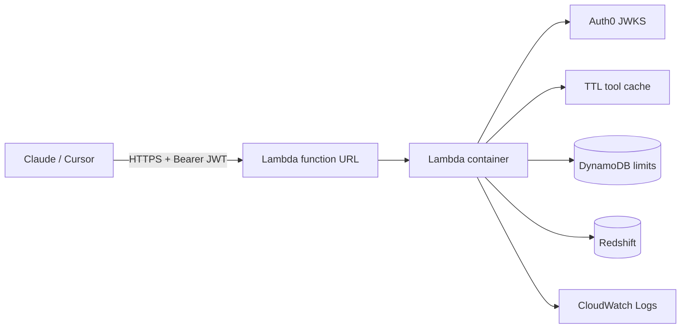

# redshift-mcp

**Read-only** [Model Context Protocol (MCP)](https://modelcontextprotocol.io) server for **Amazon Redshift**. It is meant for **Claude Desktop** and **Cursor** so you can explore schemas, sample tables, and run **validated `SELECT`** queries against your warehouse (e.g. CMO dashboards) without exposing write paths through this process.

The server uses **full database credentials** from your environment. The **SQL safety layer** (`sqlglot`, dialect `redshift`) is the main guardrail preventing DDL/DML and dangerous functions. For production, **use a dedicated read-only database user**.

## Quickstart

1. Install [uv](https://docs.astral.sh/uv/).
2. Copy env template and fill in Redshift connection details:

   ```bash
   cp .env.example .env
   # Edit .env with real REDSHIFT_* values
   ```

3. Install dependencies and run the server. Default is **stdio** (Claude Desktop local). For **remote HTTP**, set `MCP_TRANSPORT=streamable-http` in `.env` (see **Deployment**).

   ```bash
   uv sync
   uv run python -m redshift_mcp.server
   ```

   Or use the console script:

   ```bash
   uv run redshift-mcp
   ```

Logs are written to **`redshift_mcp.log`** in the **current working directory** (SQL audit: queries, timing, row counts). For `streamable-http`, **tool-call audit** lines (JSON, one per line) also go to **stdout** for log shipping (for example CloudWatch).

## Claude Desktop configuration

On macOS, edit `~/Library/Application Support/Claude/claude_desktop_config.json` and add (adjust the absolute path to **this project directory**):

```json
{
  "mcpServers": {
    "redshift": {
      "command": "uv",
      "args": [
        "--directory",
        "/absolute/path/to/redshift-mcp",
        "run",
        "python",
        "-m",
        "redshift_mcp.server"
      ]
    }
  }
}
```

Equivalent using the script entry:

```json
{
  "mcpServers": {
    "redshift": {
      "command": "uv",
      "args": [
        "--directory",
        "/absolute/path/to/redshift-mcp",
        "run",
        "redshift-mcp"
      ]
    }
  }
}
```

Restart Claude Desktop after saving.

## Cursor configuration

Add an MCP server in **Cursor Settings → MCP**, or create `.cursor/mcp.json` in this repo:

```json
{
  "mcpServers": {
    "redshift": {
      "command": "uv",
      "args": [
        "--directory",
        "/absolute/path/to/redshift-mcp",
        "run",
        "python",
        "-m",
        "redshift_mcp.server"
      ]
    }
  }
}
```

Use the same `--directory` path as your clone of this repository.

### Cursor: `MCP error -32000: Connection closed`

That means the **server process exited** right after Cursor started it (before the MCP handshake finished). Typical causes:

1. **`uv` not on `PATH` for GUI apps** — Cursor often inherits a minimal environment. Fix by using the **absolute path** to `uv` from a terminal (`which uv`), e.g. `"command": "/Users/you/.local/bin/uv"` instead of `"uv"`.
2. **Wrong `--directory`** — must be the folder that contains `pyproject.toml`, `.venv`, and `.env`.
3. **Startup error** — run the **same** `command` + `args` in a terminal from any directory; any Python traceback is the root cause. After a failed connect, check **`redshift_mcp.log`** in that project directory (if logging started).

## Deployment

Prerequisites: **AWS account**, **Docker** (recommended), **Terraform >= 1.5**, **Auth0** (API + custom tier claim), **Redshift** reachable from the VPC (security group / routes).

### Environment (remote HTTP)

See [`.env.example`](.env.example). Minimum for authenticated HTTP:

- `MCP_TRANSPORT=streamable-http`, `MCP_PUBLIC_URL` (must match the client-facing URL), `AUTH0_DOMAIN`, `AUTH0_AUDIENCE`, `AUTH0_TIER_CLAIM` (claim whose string value is `free`, `premium`, or `analyst`), Redshift variables.
- `MCP_ALLOWED_HOSTS` — comma list of allowed `Host` values (Terraform derives this from `mcp_public_url` when you leave the list empty). For local dev only: `MCP_RELAX_TRANSPORT_SECURITY=true`.
- `MCP_ALLOWED_ORIGINS` — optional comma list of allowed `Origin` headers.
- `RATE_LIMIT_DYNAMODB_TABLE` + `RATE_LIMIT_AWS_REGION` — optional; omit for in-process limits, set for shared limits across Lambda invocations (table created by Terraform). DynamoDB is reached over the AWS network without a VPC; if you place the function in a **VPC** for private Redshift, add a **DynamoDB gateway VPC endpoint** (or NAT) so rate limiting keeps working without routing public internet from private subnets.

Tier matrix: **Free** — catalog tools; **Premium** — adds sampling/profiling/size; **Analyst** — adds `run_select_query`. Limits: **30 / 150 / 500** tool calls per JWT `sub` per UTC hour. Stale **cache** may be returned on upstream errors when a prior response exists.

### Run (HTTP) locally

```bash
uv sync
MCP_TRANSPORT=streamable-http uv run python -m redshift_mcp.server
```

Verify: `curl -sS http://127.0.0.1:8000/healthz` → `{"status":"ok"}`. MCP path defaults to **`/mcp`**.

### Docker

```bash
docker build -t redshift-mcp:latest .
docker run --rm -p 8000:8000 --env-file .env redshift-mcp:latest
```

### AWS (Terraform)

In `infra/terraform/`: copy `terraform.tfvars.example` → `terraform.tfvars`, set **ECR image**, **Auth0**, **Redshift**, **`mcp_public_url`** (must match the HTTPS URL clients use — typically the **Lambda function URL** from `terraform output mcp_function_url`), **`redshift_password_secret_arn`** (Secrets Manager secret with the DB password; not stored in Lambda env), **tags**, then `terraform init && terraform apply`.

Provisions **ECR**, **DynamoDB** rate table, **Lambda** (container image), **Lambda function URL** (HTTPS), **CloudWatch** log group, **IAM** (Lambda role). Tag every resource: **`Name`**, **`Creator`**, **`Purpose`**. Allow **Redshift** inbound from the Lambda **security group** if the function runs in a VPC; without VPC, use a publicly reachable cluster or other network path consistent with your security model.

If you previously applied the older **ECS/ALB** Terraform from this repo, start from a **fresh Terraform state** or a **new workspace** before applying this Lambda configuration (resource addresses and types changed).

**`mcp_public_url`**: set to the same value as `mcp_function_url` output (no trailing slash). If you change the function URL configuration, update this variable and re-apply so Auth0 protected-resource metadata stays aligned.

**Why a Lambda function URL (not API Gateway HTTP API)** here: Auth0 and tier checks already run in the FastMCP app, so an API Gateway authorizer is redundant; a function URL is fewer billable parts and the same Mangum/HTTP v2 event shape. Switching to HTTP API later is straightforward if you need edge features (WAF, usage plans).

**Streaming / Lambda**: the server defaults to **`MCP_JSON_RESPONSE=true`**, which yields normal buffered HTTP JSON bodies — compatible with Mangum and Lambda’s synchronous **buffered** invoke mode (`BUFFERED` on the function URL). True SSE/chunked streamable responses are constrained on Lambda (payload size and streaming invoke modes vary by integration); if you disable JSON mode, expect to validate payload sizes and client behavior separately.

Rough steady-state cost: **Lambda per request + DynamoDB on-demand + logs + ECR storage** — typically **low single-digit to tens of USD/month** at low traffic versus always-on ALB + Fargate.

### Architecture



### Notes (PDF-aligned)

The assignment PDF lists **EC2 or Lambda** as hosting options on AWS (“Lambda — with whatever supporting services you need alongside it”). This stack uses **Lambda + DynamoDB + Secrets Manager** accordingly.

- **Transport**: FastMCP `streamable-http` with **JSON** responses and **buffered** function URL invoke mode; HTTP **429** + **`Retry-After`** for rate limits (ASGI middleware on JSON-RPC `-32029`).
- **Auth0**: RS256; tier embedded as `tier:<value>` in synthetic scopes for gating.
- **What broke in deploy**: typical issues are **Host header** / **Origin** rejection (fix `MCP_PUBLIC_URL` / `MCP_ALLOWED_HOSTS`), **Redshift SG** not allowing the Lambda SG (VPC case), or **Secrets Manager ARN** / IAM for `GetSecretValue`.

## Settings (environment variables)

See [`.env.example`](.env.example) for all keys.

- **Connection**: `REDSHIFT_HOST`, `REDSHIFT_PORT`, `REDSHIFT_DATABASE`, `REDSHIFT_USER`, `REDSHIFT_PASSWORD`
- **IAM auth** (optional): `REDSHIFT_IAM=true`, `REDSHIFT_CLUSTER_IDENTIFIER`, `REDSHIFT_AWS_REGION` (and optional `REDSHIFT_HOST` if your setup needs it)
- **Safety**: `MAX_ROWS_RETURNED`, `QUERY_TIMEOUT_SECONDS`, `ALLOWED_SCHEMAS`, `BLOCKED_SCHEMAS`
- **MCP / Auth0 / limits / cache**: see [`.env.example`](.env.example)

## SECURITY

- **This process holds full DB credentials** (password or IAM-based auth). Anyone who can run the MCP server process can use those credentials.
- The **only** enforced read-only boundary for **ad hoc SQL** is the **`validate_query()`** layer in [`src/redshift_mcp/safety.py`](src/redshift_mcp/safety.py). Treat bugs there as **security issues**.
- **Strongly recommended**: create a **read-only** Redshift user (e.g. `GRANT USAGE ON SCHEMA ...`; `GRANT SELECT ON ALL TABLES IN SCHEMA ...`; no write privileges). Optionally scope with `ALLOWED_SCHEMAS` / `BLOCKED_SCHEMAS`.
- Logs to `redshift_mcp.log` are an **audit trail** and intentionally **not redacted** (SQL text may include sensitive literals).

## What this server can and cannot do

| Tool | Purpose |
|------|---------|
| `list_schemas` | Lists accessible schemas (filtered by allow/block lists). |
| `list_tables` | Lists tables/views for a schema with row/size estimates when catalog views are available. |
| `describe_table` | Column metadata and table stats from `SVV_*` views where possible. |
| `sample_table` | `SELECT * ... LIMIT n` (n capped at 100), identifiers validated and quoted. |
| `run_select_query` | Only entry point for **raw SQL**; must pass `validate_query()` (single `SELECT`, no DML/DDL, schema rules, row cap). |
| `profile_column` | Safe aggregates for profiling (nulls, distinct, min/max, avg when type-appropriate). |
| `get_table_size` | Approximate size (MB) and row count from `SVV_TABLE_INFO`. |

**Cannot**: `INSERT`, `UPDATE`, `DELETE`, `COPY`, `UNLOAD`, `VACUUM`, etc. Anything not expressible as a validated `SELECT` through `run_select_query` is rejected. Other tools only run fixed, parameterized catalog queries plus identifier validation/quoting.

## Development

```bash
uv sync
uv run ruff check .
uv run pytest
```

## End-to-end check (with a real `.env`)

After filling in `.env` with a reachable cluster:

```bash
uv sync && uv run ruff check . && uv run pytest -q && uv run python -c "from redshift_mcp.config import get_settings; from redshift_mcp.db import RedshiftClient; c=RedshiftClient(get_settings()); print(c.execute('SELECT current_database(), current_user'))"
```

This runs lint, tests, and a single read-only query through the same DB layer the MCP tools use.

## License

Internal / project default — add a license file if you publish this repository.
