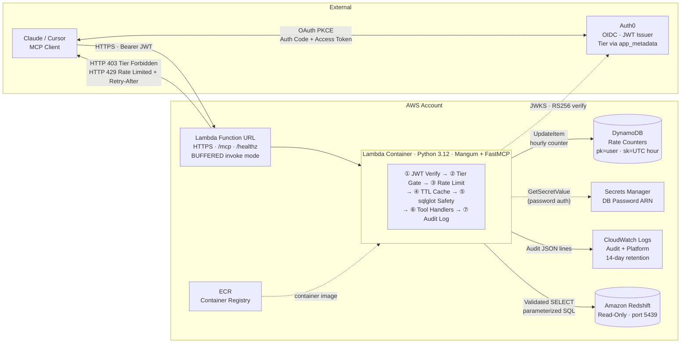
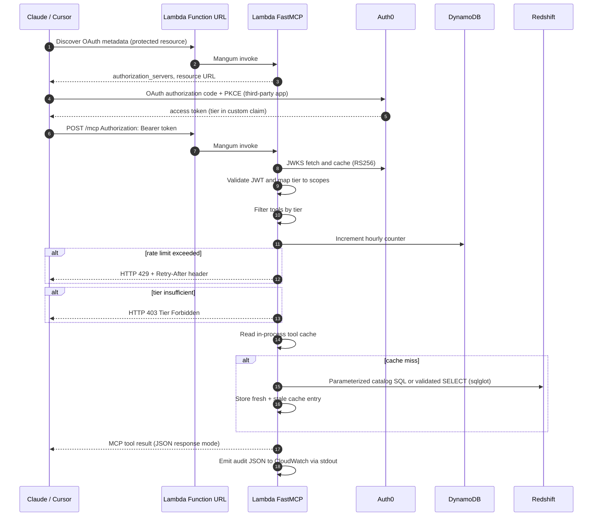
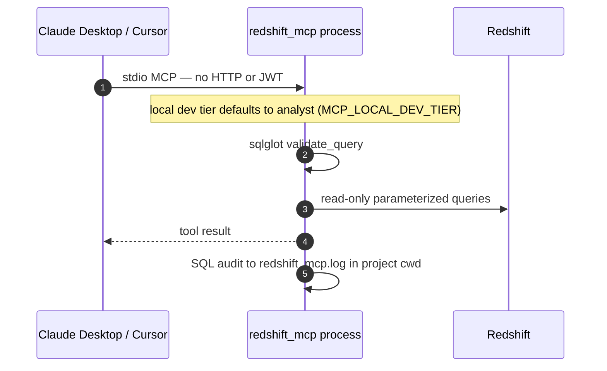

# Architecture — Redshift MCP

AWS architecture for the **redshift-mcp** deployment — a read-only Model Context Protocol (MCP) server for Amazon Redshift.

This document covers design decisions, AWS component responsibilities, runtime flows, trade-offs, and cost notes. Deployment commands and Terraform variables live in [README.md](../README.md); client setup (Claude Desktop, Cursor, Auth0) is in the same README.

## Architecture Diagram


Diagram source:

| File | Use |
|------|-----|
| [assets/architecture.mermaid](../assets/architecture.mermaid) | Mermaid source — paste into [mermaid.live](https://mermaid.live) or draw.io **Insert → Mermaid** |



## AWS Components

| Component | Responsibility |
|-----------|----------------|
| **Lambda Function URL** | Public HTTPS entry for `/mcp` (streamable HTTP MCP) and `/healthz`. `authorization_type = NONE`; Auth0 bearer validation runs in-app. `invoke_mode = BUFFERED` for JSON MCP responses. |
| **Lambda (container image)** | Runs FastMCP (`streamable-http`), Mangum ASGI adapter, Auth0 JWT verification, tier gating, per-user hourly rate limits, in-process tool result cache, sqlglot SQL safety layer, structured audit logging, and all Redshift tool handlers. |
| **ECR** | Stores the Lambda container image (`public.ecr.aws/lambda/python:3.12` base, `redshift_mcp.lambda_handler.handler` entry point). |
| **DynamoDB `rate_limits`** | **Rate limits only** (not tool cache): `pk = user_id`, `sk = UTC hour bucket`, atomic `UpdateItem` with `ConditionExpression`. Regional service outside the VPC. When Lambda uses `vpc_config`, add a **DynamoDB gateway VPC endpoint** (or NAT) so counters remain reachable. Falls back to in-process limiter locally. |
| **Tool result cache** | **In-process memory** inside the Lambda container (`ToolResultCache` in `tool_cache.py`). Per warm instance — not shared across concurrent invocations. Stale entries are served on upstream errors. |
| **Secrets Manager** | Holds the Redshift database password when not using IAM database authentication (`REDSHIFT_PASSWORD_SECRET_ARN`; read at cold start). |
| **CloudWatch Logs** | Lambda platform logs plus JSON **tool-call audit** lines on stdout (`redshift_mcp_audit_sink`). SQL detail also goes to `redshift_mcp.log` (`/tmp` on Lambda). |
| **Amazon Redshift** | Target warehouse: catalog introspection and validated `SELECT` queries only. All writes are blocked at the application layer. |
| **VPC (optional)** | When Redshift is VPC-only: Lambda subnets + security group; Redshift SG must allow inbound from the Lambda SG on port 5439. |
| **Auth0** | OAuth 2.1 / OIDC for remote MCP clients. API **identifier** must equal `MCP_PUBLIC_URL` / `AUTH0_AUDIENCE`. Tier from custom claim `https://redshift-mcp/tier` (via Post-Login Action → `user.app_metadata.tier`). |

All Terraform-managed AWS resources inherit tags from `local.common_tags`:

```
Name    = ${project_name}-stack  (per-resource Name overrides applied)
Creator = <var.creator_tag>
Purpose = <var.purpose_tag>
```

## Runtime Flows

### Remote MCP Client Tool Call (Claude / Cursor)



### Local MCP (stdio)



Local mode does **not** use Auth0, DynamoDB rate limits, or the function URL. Recommended for developers with direct network access to Redshift.

## Application Boundary (Lambda / HTTP)

| Route | Purpose |
|-------|---------|
| `/healthz` | Liveness probe — `{"status":"ok"}` |
| `/mcp` | Streamable HTTP MCP (JSON responses when `MCP_JSON_RESPONSE=true`) |
| `/.well-known/oauth-protected-resource` | OAuth protected-resource metadata (when Auth0 is configured) |

Clients never receive Redshift credentials or Secrets Manager ARNs — only the public MCP URL is needed.

### Tool Tiers and Limits

| Tier | Tools Available | Hourly Limit (per JWT `sub`, UTC hour) |
|------|-----------------|----------------------------------------|
| **free** | `list_schemas`, `list_tables`, `describe_table` | 30 calls |
| **premium** | + `sample_table`, `get_table_size`, `profile_column` | 150 calls |
| **analyst** | + `run_select_query` (raw SQL after `validate_query`) | 500 calls |

Rate-limit denials return JSON-RPC `-32029`, mapped to **HTTP 429** with `Retry-After` by `RateLimitHttp429Middleware`. Tier denials return JSON-RPC `-32030`, mapped to **HTTP 403**.

### Safety and Data Access

| Layer | Behavior |
|-------|----------|
| **sqlglot** (`safety.py`, dialect `redshift`) | Single-statement `SELECT`/`UNION` only; blocks DML/DDL, dangerous functions, schema violations. |
| **Identifier validation** | Catalog tools validate and quote schema/table/column names; no string concatenation from user input. |
| **Row / time caps** | `MAX_ROWS_RETURNED` (default 10 000), `QUERY_TIMEOUT_SECONDS` (default 60); optional `ALLOWED_SCHEMAS` / `BLOCKED_SCHEMAS`. |
| **Database principal** | Process holds full connection credentials; use a dedicated **read-only** Redshift user in production. |

## Deployment Modes

| Mode | Hosting | Auth | Rate Limit | Cache |
|------|---------|------|------------|-------|
| **Local stdio** | Developer machine (`uv run`) | None (`MCP_LOCAL_DEV_TIER`) | In-process | In-process |
| **Local HTTP** | Docker or `streamable-http` on laptop | Optional Auth0 | In-process or DynamoDB | In-process |
| **AWS (Terraform)** | Lambda container + function URL | Auth0 (required for remote) | DynamoDB (Terraform-provisioned table) | In-process per warm container |

## Trade-offs

| Choice | Why it was chosen | Cost |
|--------|-------------------|------|
| **Lambda Function URL** instead of API Gateway | Auth and tier checks live in FastMCP; fewer billable parts; same Mangum HTTP v2 event shape. | No WAF/usage plans at the edge; CORS on function URLs is limited (no `OPTIONS` in `allow_methods`). |
| **Container Lambda** instead of ZIP | Heavy deps (`sqlglot`, DB drivers) fit a container image; matches AWS Lambda Python 3.12 base. | Cold start latency + ECR storage; image rebuild/push on every release. |
| **In-process tool cache** instead of shared cache | Catalog/sample results are per-container; stale fallback on Redshift errors avoids extra infra. | Cache not shared across Lambda instances; cold containers miss warm cache. |
| **DynamoDB for rate limits only** | Shared counters across concurrent invocations; on-demand billing; atomic `UpdateItem`. | Slightly higher latency than memory; fails **open** on DynamoDB errors. |
| **Auth0** instead of self-hosted IdP | Managed OAuth 2.1 for Claude/Cursor third-party MCP flows; tier via `app_metadata`. | SaaS dependency; tenant must enable Resource Parameter Compatibility Profile. |
| **Buffered Function URL + JSON MCP** | Compatible with Mangum and Lambda synchronous invoke; avoids SSE/streaming payload limits. | Not true streaming MCP; large payloads must fit Lambda response size limits. |
| **Read-only MCP only** | Scope: exploration and validated analytics, no writes. | `validate_query` is the sole guardrail for ad-hoc SQL — treat bypass bugs as security incidents. |

## Cost Envelope

Approximate steady-state cost at low traffic (no always-on compute except Redshift itself):

| AWS Item | Monthly Estimate |
|----------|------------------|
| Lambda (requests + GB-seconds) | Free tier or low single-digit USD for demos |
| Lambda Function URL | No separate charge beyond Lambda invocations |
| DynamoDB on-demand (rate table) | Usually under **$1** for light use |
| CloudWatch Logs | Free tier / cents for 14-day retention |
| Secrets Manager | ~**$0.40** per secret |
| ECR storage | Cents to low USD depending on image size |
| **Redshift cluster** | Dominant cost (not provisioned by this Terraform) |

## Production Gaps

| Gap | Production Direction |
|-----|----------------------|
| **SQL safety relies on sqlglot** | Defense in depth: read-only DB user, schema allowlists, query logging review. |
| **Function URL is public (app-layer auth only)** | Add CloudFront + WAF, or migrate to API Gateway with throttling. |
| **Per-instance cache** | Accept for catalog tools or add ElastiCache/DynamoDB L2 if cross-instance consistency is required. |
| **Rate limit fails open on DynamoDB errors** | Monitor DynamoDB health; consider fail-closed for abuse-sensitive deployments. |
| **Lambda cold starts** | Enable provisioned concurrency if first-request latency is critical. |
| **VPC + DynamoDB** | Add DynamoDB gateway VPC endpoint (or NAT) when Lambda runs in private subnets. |
| **Audit in CloudWatch only** | Ship logs to S3/OpenSearch for long-term retention; avoid sensitive SQL in shared log streams. |
| **Auth0 tier changes require re-auth** | Users must reconnect their MCP connector after `app_metadata.tier` changes. |
