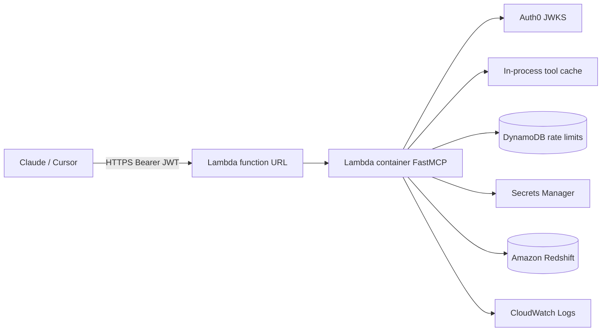
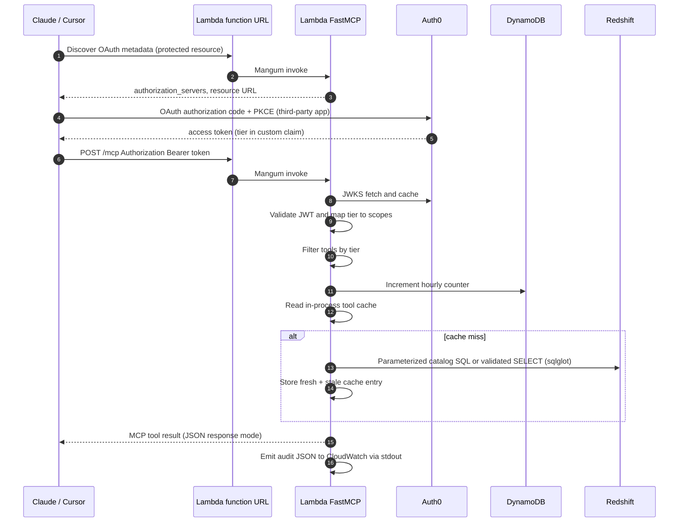
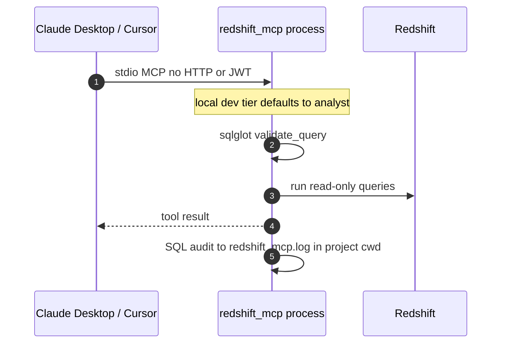

# ARCHITECTURE.md

AWS architecture for the **redshift-mcp** deployment — a read-only Model Context Protocol (MCP) server for Amazon Redshift.

This doc owns design decisions, AWS component responsibilities, trade-offs, and cost notes. Deployment commands and Terraform variables live in [README.md](README.md) (Deployment section); client setup (Claude Desktop, Cursor, Auth0) is in the same README.

## AWS Architecture Diagram

Editable diagrams (see [assets/DIAGRAM.md](assets/DIAGRAM.md)):

| File | Use |
|------|-----|
| [assets/architecture.drawio](assets/architecture.drawio) | **Open in draw.io** (File → Open) — preferred |
| [assets/architecture.mermaid](assets/architecture.mermaid) | Paste into draw.io **Insert → Mermaid** or [mermaid.live](https://mermaid.live) |
| [assets/architecture.svg](assets/architecture.svg) | Preview only; draw.io SVG import often fails |




## AWS Components

| Component | Responsibility |
|-----------|----------------|
| **Lambda function URL** | Public HTTPS entry for `/mcp` (streamable HTTP MCP) and `/healthz`. `authorization_type = NONE`; Auth0 bearer validation runs in the app. `invoke_mode = BUFFERED` for JSON MCP responses. |
| **Lambda (container image)** | Runs FastMCP (`streamable-http`), Mangum ASGI adapter, Auth0 JWT verification, tier gating, per-user hourly rate limits, in-process tool result cache, structured audit logging, and all Redshift tool handlers. |
| **ECR** | Stores the Lambda container image (`public.ecr.aws/lambda/python:3.12` base, `redshift_mcp.lambda_handler.handler` entry). |
| **DynamoDB `rate_limits`** | **Rate limits only** (not tool cache): `pk = user_id`, `sk = UTC hour bucket`, atomic `UpdateItem`. Regional service **outside the VPC**. When Lambda uses `vpc_config`, add a **DynamoDB gateway VPC endpoint** (or NAT) so counters still work. Omitted locally → in-process limiter. |
| **Tool result cache** | **In-process memory** inside the Lambda container (`ToolResultCache` in `tool_cache.py`); per warm instance, not shared across invocations or stored in DynamoDB. |
| **Secrets Manager** | Holds the Redshift database password when not using IAM database authentication (`REDSHIFT_PASSWORD_SECRET_ARN`; read at settings load). |
| **CloudWatch Logs** | Lambda platform logs plus JSON **tool-call audit** lines on stdout (`redshift_mcp_audit_sink`). SQL detail also goes to `redshift_mcp.log` (`/tmp` on Lambda). |
| **Amazon Redshift** | Target warehouse: catalog introspection and validated `SELECT` queries only. |
| **VPC (optional)** | When Redshift is VPC-only: Lambda subnets + security group; Redshift SG must allow inbound from the Lambda SG on port 5439. |
| **Auth0** | OAuth/OIDC for remote MCP clients. API **identifier** must equal `MCP_PUBLIC_URL` / `AUTH0_AUDIENCE`. Tier from custom claim `https://redshift-mcp/tier` (via Post-Login Action → `user.app_metadata.tier`). |

All Terraform-managed AWS resources inherit tags from `local.common_tags`:

```text
Name    = ${project_name}-stack (per-resource Name overrides)
Creator = <var.creator_tag>
Purpose = <var.purpose_tag>
```

## Runtime Flows

### Remote MCP Client Tool Call (Claude / Cursor)



### Local MCP (stdio)



Local mode does **not** use Auth0, DynamoDB rate limits, or the function URL. It is the recommended path for developers with direct network access to Redshift.

## Application Boundary (Lambda / HTTP)

The server exposes a small HTTP surface on top of FastMCP streamable HTTP:

| Route | Purpose |
|-------|---------|
| `/healthz` | Liveness (`{"status":"ok"}`) |
| `/mcp` | Streamable HTTP MCP (JSON responses when `MCP_JSON_RESPONSE=true`) |
| `/.well-known/oauth-protected-resource` | OAuth protected-resource metadata (when Auth0 is configured) |

Clients never receive Redshift credentials or Secrets Manager ARNs. They only need the public MCP URL and complete Auth0 login through the host app (Claude cloud or Cursor).

### Tool tiers and limits

| Tier | Tools | Hourly limit (per JWT `sub`, UTC hour) |
|------|-------|----------------------------------------|
| **free** | `list_schemas`, `list_tables`, `describe_table` | 30 |
| **premium** | + `sample_table`, `get_table_size`, `profile_column` | 150 |
| **analyst** | + `run_select_query` (raw SQL after `validate_query`) | 500 |

Rate-limit denials return JSON-RPC `-32029`, mapped to **HTTP 429** with `Retry-After` by `RateLimitHttp429Middleware`. Tier denials use `-32030`.

### Safety and data access

| Layer | Behavior |
|-------|----------|
| **sqlglot** (`safety.py`, dialect `redshift`) | Single-statement `SELECT`/`UNION` only; blocks DML/DDL, dangerous functions, schema violations. |
| **Identifier validation** | Catalog tools quote schema/table/column names; no string concatenation from user input. |
| **Row / time caps** | `MAX_ROWS_RETURNED`, `QUERY_TIMEOUT_SECONDS`; optional `ALLOWED_SCHEMAS` / `BLOCKED_SCHEMAS`. |
| **Database principal** | Process holds full connection credentials; use a dedicated **read-only** Redshift user in production. |

## Deployment Modes

| Mode | Hosting | Auth | Rate limit | Cache |
|------|---------|------|------------|-------|
| **Local stdio** | Developer machine (`uv run`) | None (`MCP_LOCAL_DEV_TIER`) | In-process | In-process |
| **Local HTTP** | Docker or `streamable-http` on laptop | Optional Auth0 | In-process or DynamoDB | In-process |
| **AWS (Terraform)** | Lambda container + function URL | Auth0 required for production remote use | DynamoDB (Terraform table) | In-process per warm container |

## Trade-offs

| Choice | Why it was chosen | Cost |
|--------|-------------------|------|
| **Lambda function URL** instead of API Gateway HTTP API | Auth and tier checks already live in FastMCP; fewer billable parts; same Mangum HTTP v2 shape. JWT validation stays in-app. | No WAF/usage plans at the edge; CORS on function URLs is limited (e.g. no `OPTIONS` in allow_methods). |
| **Container Lambda** instead of ZIP | Heavy deps (`sqlglot`, DB drivers, `uv` install path) fit an image; matches AWS Lambda Python 3.12 base. | Cold start + ECR storage; image rebuild/push on every release. |
| **In-process tool cache** instead of DynamoDB | Catalog/sample results are per-container; stale fallback on Redshift errors avoids extra infra. | Cache not shared across Lambda instances; repeat cold containers miss cache. |
| **DynamoDB for rate limits only** | Shared counters across concurrent invocations; on-demand billing. | Slightly higher latency than memory; fails **open** on DynamoDB errors. |
| **Auth0** instead of self-hosted IdP | Managed OAuth for Claude/Cursor third-party MCP flows; tier via `app_metadata`. | SaaS cost; tenant must enable Resource Parameter Compatibility Profile. |
| **Buffered function URL + JSON MCP** | Compatible with Mangum and Lambda synchronous invoke; avoids SSE/streaming limits. | Not true streaming MCP; large payloads must fit Lambda response limits. |
| **Read-only MCP only** | Assignment scope: exploration and validated analytics, not writes. | `validate_query` is the main guardrail — treat bypass bugs as security incidents. |

## Cost Envelope

Approximate steady-state cost at low traffic (no always-on compute except Redshift itself):

| AWS item | Monthly estimate |
|----------|------------------|
| Lambda (requests + GB-seconds) | Free tier or low single-digit USD for demos |
| Lambda function URL | No separate charge beyond Lambda invocations |
| DynamoDB on-demand (rate table) | Usually under **$1** for light use |
| CloudWatch Logs | Free tier / cents for 14-day retention |
| Secrets Manager | ~**$0.40** per secret |
| ECR storage | Cents to low USD depending on image size and retention |
| **Redshift cluster** | Dominant cost (not created by this Terraform) |

Unlike a Team 2–style stack with always-on Keycloak EC2, this design has **no fixed identity compute** on AWS — Auth0 is external.

## Production Gaps

| Gap | Production direction |
|-----|----------------------|
| **SQL safety relies on sqlglot** | Defense in depth: read-only DB user, schema allowlists, query logging review, periodic red-team of `validate_query`. |
| **Function URL is public with app-layer auth only** | Add CloudFront + WAF, or migrate to API Gateway with throttling; restrict `MCP_ALLOWED_ORIGINS` / hosts. |
| **Per-instance cache** | Accept for catalog tools or add ElastiCache/DynamoDB L2 if cross-instance consistency matters. |
| **Rate limit fail-open on DDB errors** | Monitor DynamoDB; consider fail-closed for abuse-sensitive environments. |
| **Lambda cold starts** | Provisioned concurrency if first-tool latency matters for demos. |
| **VPC + DynamoDB** | Add DynamoDB gateway endpoint (or NAT) when Lambda is in private subnets for Redshift. |
| **Audit in CloudWatch only** | Ship logs to S3/OpenSearch; avoid sensitive SQL in shared log streams if literals are sensitive. |
| **Auth0 tier changes** | Users must re-authenticate MCP connectors after `app_metadata.tier` updates. |

## Eraser.io Diagram Prompt

Copy the block below into Eraser (AI diagram or manual cloud architecture mode). Adjust names/tags to match your `terraform.tfvars`.

```text
Create an AWS cloud architecture diagram titled "Redshift MCP — AWS Production".

Style: official AWS icons, left-to-right data flow, grouped boxes for "AWS Account" and optional "VPC".

External (left):
- "Claude / Cursor" user icon — label: "MCP client (HTTPS + OAuth PKCE)"
- "Auth0" — label: "OIDC / JWT issuer, tier claim https://redshift-mcp/tier"

AWS Account:
1. "Lambda Function URL" (HTTPS) — arrow to "Lambda (container)" — label: "POST /mcp, GET /healthz, BUFFERED invoke"
2. "Lambda (container)" from ECR image redshift-mcp — bullets inside: FastMCP, Mangum, Auth0 JWT verify, tier gate, sqlglot safety, tool cache (in-memory)
3. "Amazon ECR" — dashed arrow: "container image"
4. "DynamoDB" table — label: "rate_limits pk=user sk=hour bucket" — arrow from Lambda: "UpdateItem hourly limits"
5. "Secrets Manager" — arrow from Lambda: "GetSecretValue (DB password)" — only when not using IAM DB auth
6. "CloudWatch Logs" — arrow from Lambda: "audit JSON + platform logs"
7. Optional VPC group containing:
   - "Lambda ENI" in private subnets + security group
   - "Amazon Redshift" cluster — arrow Lambda → Redshift port 5439
   - Note on VPC edge: "DynamoDB gateway endpoint or NAT if Lambda in VPC"
8. If IAM DB auth variant: arrow Lambda → Redshift using "GetClusterCredentials" (no Secrets Manager arrow)

Connections to draw:
- Client → Function URL → Lambda
- Client ↔ Auth0 (OAuth, dashed)
- Lambda → Auth0 JWKS (dashed, validate token)
- Lambda → DynamoDB, Secrets Manager (optional), CloudWatch, Redshift
- ECR → Lambda (deploy)

Do NOT include: API Gateway, CloudFront, S3 web UI, Keycloak EC2, Redis, or upstream Fin APIs.

Add a small legend: green path = read-only SELECT / catalog; red X on INSERT/UPDATE/DELETE at Redshift boundary.

Tags note on resources: Name, Creator, Purpose from Terraform common_tags.
```
